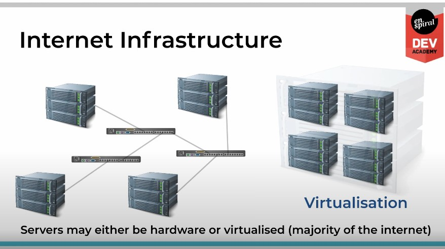
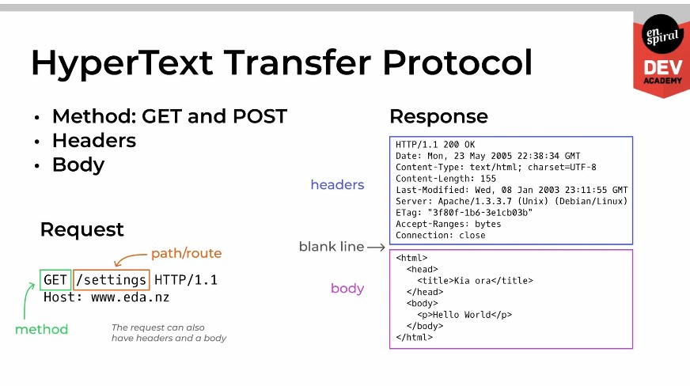

## How the Web Works

- Servers listen on a port registered with the OS
- Browsers send requests and receive responses
- Servers receive requests and send responses
- Routes are responsible for fulfilling requests
- HTTP GET requests are asking for data from the server
- HTTP POST requests are sending data to the server

### Internet Infrastructure

  
Servers

  - Servers may either be hardware or virtualised (majority of the internet)

  

  1. Virtual servers are created by partitioning a physical server into multiple virtual machines using software such as VMware or VirtualBox.

  2. These virtual servers can be customized to have different operating systems, software applications, and configurations to meet specific needs.

  3. Virtual servers are hosted in data centers that are designed to provide high levels of security, reliability, and connectivity.

  4. Data centers are connected to the internet through high-speed connections provided by internet service providers (ISPs).

  5. Domain name system (DNS) servers translate human-readable domain names (such as google.com) into IP addresses (such as 172.217.6.206) that computers use to connect to websites.

  6. Load balancers distribute traffic across multiple virtual servers to improve performance and availability.

  7. Content delivery networks (CDNs) use geographically distributed servers to cache and deliver content to users more quickly.

  8. Virtual private networks (VPNs) provide a secure connection between a user's device and a virtual server.

  9. Cloud computing services such as Amazon Web Services (AWS) and Microsoft Azure provide virtual servers as a service, allowing businesses to easily provision and scale servers as needed.

  10. The internet infrastructure is constantly evolving, with new technologies and services being developed to improve performance, security, and reliability.

 

### DNS: Internet Addressing

- Standards-based Protocol
  - Others: HTTP (Web), FTP (files), SMTP (email)
- Translates domain names to IP addresses
- Network devices (like routers) operate on IP addresses
  - handbook.eda.nz => 172.67.199.229
- Metaphor: postal addresses to latitude, longitude
  - 12 Morgan St, AKL => 36.8644915.174.7740885

 

### Ports and Services

- Protocols are implemented as services
  - Think of them as applications without a user interface
- The server uses ports to deliver messages form the network
  - Metaphor: each port is a flatmate at the flat's address
- Ports less than 1024 are well known (allocated to a protocol)
  - HTTP: 80, HTTPS: 443, DNS: 53, NTP: 123, SSH:22

 

 

  

