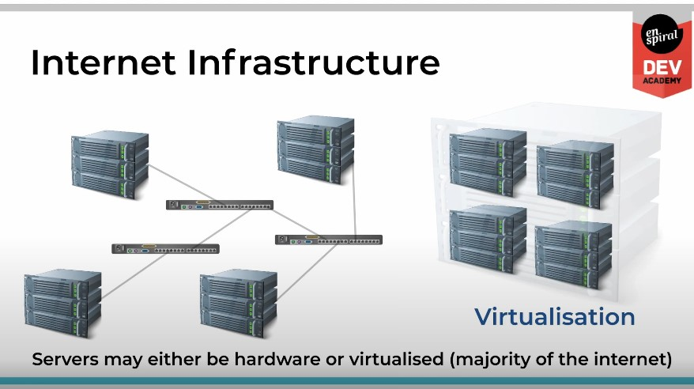
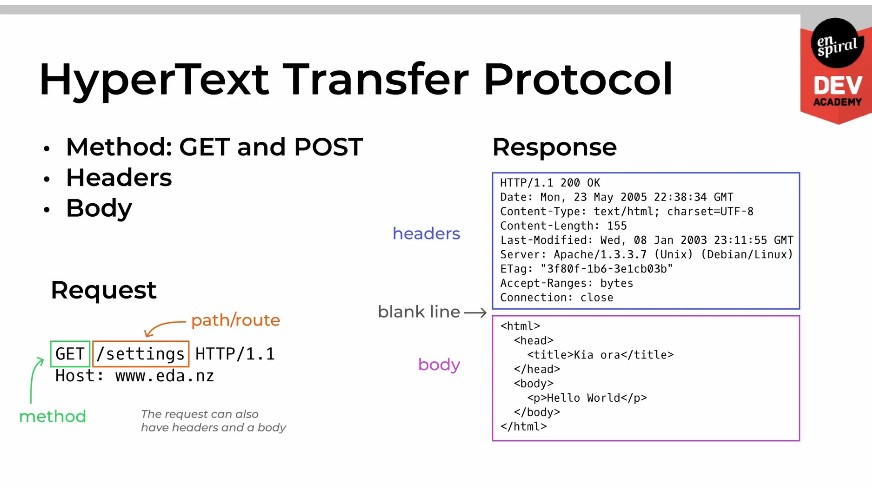
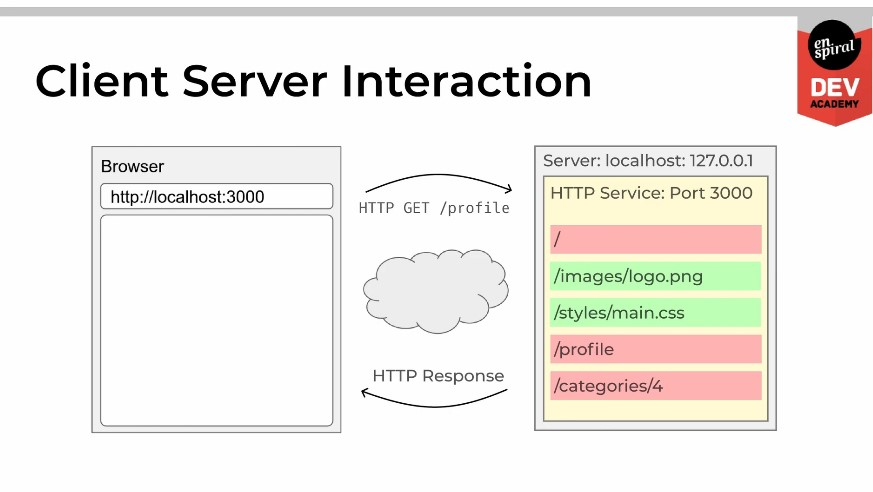

# How the Web Works 🌐

- **Servers Listen on a Port Registered with the OS**
- **Browsers Send Requests and Receive Responses**
- **Servers Receive Requests and Send Responses**
- **Routes Fulfill Requests**
- **HTTP GET Requests Ask for Data from the Server**
- **HTTP POST Requests Send Data to the Server**

### Internet Infrastructure 🏗️

  
Servers

  - Servers may be hardware or virtualized (common on the internet).

  

  1. Virtual servers are created by partitioning a physical server into multiple virtual machines, using software like VMware or VirtualBox.

  2. Virtual servers can have different operating systems, software applications, and configurations to meet specific needs.

  3. Hosted in data centers designed for high security, reliability, and connectivity.

  4. Data centers connect to the internet through high-speed connections provided by internet service providers (ISPs).

  5. DNS servers translate human-readable domain names (e.g., google.com) into IP addresses (e.g., 172.217.6.206) for computers to connect to websites.

  6. Load balancers distribute traffic across multiple virtual servers for improved performance and availability.

  7. Content delivery networks (CDNs) use geographically distributed servers to cache and deliver content quickly.

  8. Virtual private networks (VPNs) provide a secure connection between a user's device and a virtual server.

  9. Cloud computing services (e.g., AWS, Azure) offer virtual servers as a service for easy provisioning and scaling.

  10. Internet infrastructure evolves with new technologies and services for better performance, security, and reliability.

### DNS: Internet Addressing 🌐

- Standards-based Protocol (e.g., HTTP for the web, FTP for files, SMTP for email)
- Translates domain names to IP addresses
- Network devices (like routers) operate on IP addresses (e.g., handbook.eda.nz => 172.67.199.229)
- Metaphor: Postal addresses to latitude, longitude (e.g., 12 Morgan St, AKL => 36.8644915, 174.7740885)

### Ports and Services 🚢

- Protocols implemented as services (think of them as applications without a user interface)
- Servers use ports to deliver messages from the network
- Metaphor: Each port is a flatmate at the flat's address
- Ports less than 1024 are well-known (allocated to a protocol)
  - HTTP: 80, HTTPS: 443, DNS: 53, NTP: 123, SSH: 22

